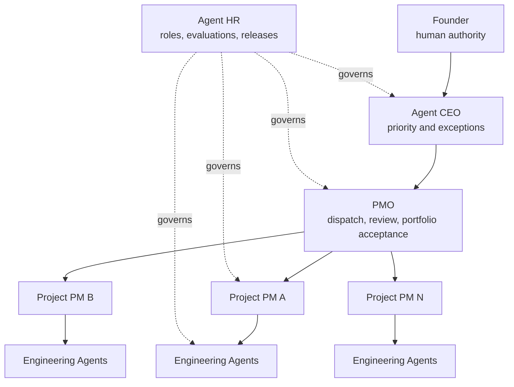

# Agent Project OS

[简体中文](README.zh-CN.md)

**Run a one-person AI engineering organization from Git.**

Agent Project OS is a local-first operating system for individual developers and one-person teams maintaining many AI-native projects. It combines a repo-native project kernel, a Founder/CEO/PMO supervision chain, Agent workforce governance, deterministic cadence planning, and adapters for Codex, Claude Code, and DeepSeek Harness.

> **Alpha:** the current local candidate is `0.4.0a1`. It is source-only, untagged, and not published to PyPI. Public Schema and CLI surfaces may still change before `1.0.0`.

The design rule is simple: project repositories own engineering facts; the organization repository owns registrations, assignments, immutable reports, reviews, and evidence pointers. Agents propose or report. Deterministic code validates. Humans retain final authority.

## The problem it solves

When one person maintains many AI-native projects, the hard part is no longer only generating code. It is remembering which project matters now, who is accountable, what is blocked, what must be accepted next, which supervision run is due, and whether an Agent's Prompt or Skill version is still trustworthy.

Agent Project OS gives those questions durable, reviewable boundaries:

- **Project facts stay with the project.** Tasks, evidence, decisions, and handoffs remain in each project repository.
- **The portfolio has an accountable chain.** Founder, Agent CEO, PMO, and one accountable PM per active project have distinct responsibilities.
- **Agent capability changes are governed.** Roles, evaluations, candidate releases, promotion, rollback, pause, and retirement are recorded separately from model or client identity.
- **Supervision is deterministic.** Daily, weekly, and monthly due work becomes an idempotent plan that an external scheduler can wake up.
- **The control plane is rebuildable.** JSON, HTML, and SQLite views are disposable projections of Git-managed records.
- **Runtime differences stay at the edge.** Codex, Claude Code, and DeepSeek Harness receive client-specific entry files without changing the core protocol.

## Organization model



This hierarchy is a governance graph, not an Agent runtime. Agent Project OS does not start models, control client processes, or replace Git.

## What is included

| Layer | Current capability |
|---|---|
| Project Kernel | Task, E0–E4 evidence, decision, handoff, inbox proposal, acceptance receipt, and activity event records |
| Organization | Organization manifest, project registry, exactly one accountable PM per active project, dispatches, child-PM reports, PMO reviews, portfolio reviews, and CEO exception queue |
| Agent Workforce | Agent and role registries, capability profiles, Prompt/Skill asset digests, evaluation, candidate release, promotion, rollback, pause, and retirement |
| Cadence | Time-zone-aware daily/weekly/monthly due calculation, idempotent run planning, bounded retry records, pause, and close |
| Federation | Cross-repository dependencies, provided/consumed interfaces, affected-project calculation, versioned handoffs, and acceptance receipts |
| Adapters | Project-local instructions, Skills/bundles, lifecycle event normalization, and dispatch rendering for Codex, Claude Code, and DeepSeek Harness |
| Projections | Rebuildable SQLite index plus read-only JSON/HTML organization dashboard and private-snapshot comparison |

## Five-minute first success

### Requirements

- Python 3.9–3.13
- Git
- macOS or Linux; WSL remains a preview target

Run the fully synthetic three-project organization without credentials or private data:

```bash
git clone https://github.com/Jinchengawu/Agent-Project-OS.git
cd Agent-Project-OS
python3 -m venv .venv
. .venv/bin/activate
python -m pip install -e '.[test]'
agent-project --root examples/federated-workspace validate
agent-project --root examples/federated-workspace --json dashboard build --as-of 2026-08-18T12:00:00+08:00 --dry-run
```

The final command plans a disposable dashboard and returns an observable result without writing it:

```json
{
  "agent_count": 5,
  "decision_count": 1,
  "due_count": 1,
  "project_count": 3,
  "status": "planned"
}
```

The example contains three autonomous projects, five Agents, three accountable PM assignments, one reviewed Agent upgrade, two accepted PM reports, and one blocked report routed to the CEO exception queue. Read the [synthetic workspace walkthrough](examples/federated-workspace/WORKSPACE.md).

If validation fails, the CLI reports the invalid record or cross-record invariant and does not silently repair accepted state. Use `--dry-run` on write commands to inspect planned changes first.

## Repository model

Each managed project keeps its own engineering state:

```text
AGENTS.md
.agent-project/
├── manifest.json
├── policy.json
├── tasks/
├── evidence/
├── decisions/
├── handoffs/
├── inbox/
├── receipts/
└── events/
```

The organization control repository adds relationships and immutable supervision records without copying project task ledgers:

```text
.agent-project/
├── organization.json
├── project-registry.json
├── assignments/
├── dispatches/
├── supervision/
├── reports/
├── reviews/
├── workforce/
└── events/
```

Current accepted state lives in entity files. Events, change requests, reports, and receipts use one record per file to avoid a shared JSONL append hotspot. SQLite is optional and can be deleted and rebuilt.

## Core operating loops

### CEO/PMO supervision

1. Register an autonomous project and assign exactly one accountable PM.
2. Calculate due supervision work from its policy and time zone.
3. Issue a structured dispatch envelope without launching a client process.
4. Let the project PM submit a report containing evidence pointers rather than a copied task ledger.
5. Let PMO accept or reject the report; route unresolved priority, ownership, risk, and conflict exceptions to the CEO queue.

An accepted report advances the next supervision window. Replayed reports, unknown projects, duplicate PMs, incompatible interfaces, and unsupported completion claims are rejected.

### Agent HR

Agent identity, runtime identity, model identity, and role are separate records. A candidate Agent release points to a Prompt, Skill, or bundle by path, commit, and SHA-256 digest.

Promotion requires a passed evaluation and separation between candidate, reviewer, and approver. The validator rejects self-promotion, digest drift, multiple active releases, missing rollback points, duplicate roles, and retirement while an Agent still owns an active assignment.

Agent Project OS governs the lifecycle and evidence. It does not own the Prompt or Skill contents; those can remain in a dedicated capability repository such as an internal AI-PMO project.

### Cadence and dispatch

The core computes due items and creates idempotent `cadence-run-v1` plans. Codex Automation, cron, CI, or another scheduler may wake those plans, but cannot bypass human authority gates. Repeated triggers in the same window reuse the run instead of duplicating it; failed actions have a bounded retry record.

Adapters turn a neutral dispatch envelope into a project-local client entrypoint. Client-specific worktrees, subagents, Agent Teams, or plugin composition remain optional enhancements, not cross-client feature-parity promises.

## Evidence-gated engineering

Task completion, consumer acceptance, and external results remain different facts:

| Grade | Meaning | Boundary |
|---|---|---|
| E0 | Claim or declaration | Does not prove an artifact exists |
| E1 | Produced artifact | Does not prove deterministic verification passed |
| E2 | Verification command executed and passed | Does not prove consumer acceptance |
| E3 | Consumer acceptance backed by a receipt | Does not prove an external outcome |
| E4 | Observed external outcome | Applies only to the recorded scope |

A task cannot enter `done` without accepted E2-or-stronger evidence. The CLI records actual execution metadata for E2 rather than trusting a self-declared `passed` field.

## CLI surface

```text
agent-project init
agent-project org init|status|validate
agent-project project add|list|show|assign-pm
agent-project task create|update|submit|accept|reject
agent-project evidence add
agent-project decision propose|accept|reject|supersede
agent-project handoff create|validate
agent-project supervision due|dispatch|submit|accept|reject
agent-project portfolio review
agent-project role add|assign
agent-project agent add|list|show|evaluate|propose-upgrade|promote|rollback|pause|retire
agent-project workforce review
agent-project cadence due|plan|record|close
agent-project adapter render|install|uninstall|doctor|render-dispatch
agent-project migrate portfolio-v1
agent-project dashboard build
agent-project shadow compare
agent-project affected
agent-project index rebuild
agent-project status
agent-project validate
```

Write commands support `--dry-run`. Machine consumers can request JSON with the global `--json` option.

## Runtime compatibility

| Surface | Status | Verified scope and limit |
|---|---|---|
| Codex | Supported | `AGENTS.md`, project Skill, adapter golden tests, normalized events, neutral dispatch rendering, and a historical isolated project lifecycle smoke |
| Claude Code | Supported | Shared-rule import through `CLAUDE.md`, project Skill, Hooks, adapter golden tests, dispatch rendering, and a historical isolated project lifecycle smoke |
| DeepSeek Harness | Preview | Keyless bundle/profile rendering, normalized events, golden tests, and JavaScript syntax checks at the pinned compatibility point; no credentialed live loop is claimed |

Runtime, `client_version`, optional `model_id`, and optional `provider_hint` are recorded independently. A Claude Code session may use a non-Anthropic model without corrupting the client identity.

DeepSeek Harness itself is in developer preview and may introduce breaking changes. Those changes are confined to its Adapter rather than changing the core Schema.

See [Compatibility](docs/COMPATIBILITY.md), [Adapter Design](docs/ADAPTERS.md), and the [historical client smoke record](release/smoke-results-v0.1.json).

## Verification status

The `0.4.0a1` local gate observed on macOS/Python 3.11 passes:

- 33 integration and contract tests;
- 28 loadable Draft 2020-12 Schema documents with positive and negative examples;
- self-hosted repository and synthetic-organization validation;
- a 30-project/50-Agent synthetic scale gate;
- privacy and bilingual-document checks;
- Python compilation and DeepSeek Harness bundle syntax;
- source distribution, wheel build, and isolated wheel CLI smoke.

This is local alpha evidence, not public adoption, production readiness, or proof that the private-project shadow gate has passed. The repository configures Python 3.9–3.13 CI, but this local evidence does not substitute for a current remote CI result.

Run the same deterministic project gate with `python scripts/release_gate.py`. Details are recorded in [Release Candidate Evidence](docs/RELEASE-EVIDENCE.md).

## Security, privacy, and human authority

Core operation requires no hosted service, cloud database, account, or model credential. Public fixtures use synthetic identities and relative paths. A privacy scan checks common secrets, personal absolute paths, and private topology names, but a passing scan is not proof that publication is safe.

Important boundaries:

- verification commands run with the current user's permissions and are not sandboxed;
- the core plans work but does not start or control Agent clients;
- production, credentials, funds, permission escalation, public release, destructive migration, and Agent promotion retain human approval;
- user-level Adapter installation is opt-in, backed up, marked, idempotent, and uninstallable;
- the read-only dashboard is a disposable projection and never becomes a second fact source;
- V1 does not provide team accounts, RBAC, cloud synchronization, a hosted SaaS, or execution isolation.

Read [Security Policy](SECURITY.md), [Privacy and Repository Hygiene](docs/PRIVACY.md), and [Operations](docs/OPERATIONS.md) before using the system with sensitive repositories.

## Roadmap and release boundary

| Gate | State |
|---|---|
| `0.1.0a1` Project Kernel | Historical pushed baseline; intentionally untagged |
| `0.2.0a1` CEO/PMO loop | Implemented and covered by synthetic integration tests |
| `0.3.0a1` Agent HR | Implemented and covered by synthetic integration tests |
| `0.4.0a1` Cadence and dispatch | Current local candidate |
| `0.5.0b1` scale and shadow operation | Public dashboard and synthetic scale gate implemented; two private supervision cycles remain unverified |
| `1.0.0` stable protocol | Planned; requires Schema/CLI freeze, migration checks, and one separately approved private single-source pilot |

No PyPI package, GitHub Release, or public version tag is claimed. See the [Roadmap](docs/ROADMAP.md) and [Versioning Policy](docs/VERSIONING.md).

## Documentation

| Read this | For |
|---|---|
| [Method](docs/METHOD.md) | Local-first, repo-native, federated, evidence-gated principles |
| [Architecture](docs/ARCHITECTURE.md) | Kernel, Governance, Workforce, Cadence, Adapters, and projections |
| [Organization](docs/ORGANIZATION.md) | Founder/CEO/PMO/project-PM responsibilities and report acceptance |
| [Workforce](docs/WORKFORCE.md) | Agent HR roles, evaluations, releases, promotion, and rollback |
| [Cadence](docs/CADENCE.md) | Due calculation, idempotency, retry, and scheduler boundaries |
| [Data Model](docs/DATA-MODEL.md) | Record types, states, and references |
| [Protocol](docs/PROTOCOL.md) | Cross-project artifacts and acceptance rules |
| [Operations](docs/OPERATIONS.md) | Rebuild, migration, shadow comparison, and recovery |
| [Governance Boundaries](docs/GOVERNANCE-PACKS.md) | Integration with AI-PMO and workflow-observation projects |

## Contributing

Contributions are welcome while the protocol is still alpha. Start with [CONTRIBUTING.md](CONTRIBUTING.md), preserve runtime-neutral core semantics, include deterministic evidence for behavior changes, and never commit private paths, credentials, or real project data.

Security reports follow [SECURITY.md](SECURITY.md). Community participation follows the [Code of Conduct](CODE_OF_CONDUCT.md).

## License

Agent Project OS is licensed under [Apache License 2.0](LICENSE). See [NOTICE](NOTICE) for attribution information.
