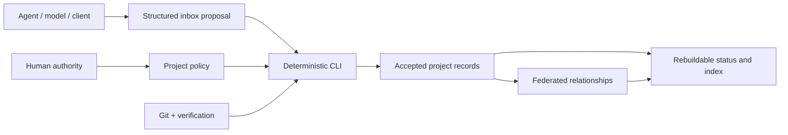

# Agent Project OS

[简体中文](README.zh-CN.md)

**Keep AI engineering facts in your repositories—not in one client’s chat history.**

Agent Project OS is a local-first, repo-native project governance protocol and CLI for individual developers and one-person teams maintaining long-lived or federated projects with Codex, Claude Code, and DeepSeek Harness.

> **Pre-release:** `0.1.0a1` is a local release candidate. Install it from a source checkout. The public Schema and CLI may still change before the first stable release.

Repositories preserve facts and policy. Agents propose structured changes. A deterministic CLI validates and accepts them. Portfolio views are rebuilt from engineering evidence. Humans retain authority over irreversible actions, production, permissions, funds, and publication.

## Why this exists

An AI client can report that a task is complete while the repository, its consumers, and the outside world each say something different. Long chat histories also do not travel cleanly across models, clients, machines, or repositories.

Agent Project OS gives those facts durable, reviewable boundaries:

- **Project state lives with the project.** Git-tracked JSON and Markdown are the portable source of truth.
- **Completion requires evidence.** A task cannot enter `done` without accepted E2-or-stronger evidence.
- **Cross-project delivery requires a consumer.** E3 is recorded only with an accepted consumer receipt.
- **Clients and models are separate identities.** `runtime`, `client_version`, `model_id`, and `provider_hint` are not collapsed into one field.
- **The control plane is disposable.** Delete the SQLite index and rebuild it from project and portfolio records.
- **Client differences stay at the edge.** Codex, Claude Code, and DeepSeek Harness conventions live in adapters, not in the core protocol.

## Operating model



The core is not an agent runtime, model router, hosted project manager, or replacement for Git. It is the shared engineering record beneath those tools.

## Five-minute first success

### Requirements

- Python 3.9–3.13
- Git for versioning the resulting project records
- A source checkout of this pre-release repository

Create a virtual environment from the repository root and install the CLI:

```bash
python3 -m venv .venv
. .venv/bin/activate
python -m pip install -e .
agent-project --help
```

Initialize a clean project beside the checkout:

```bash
mkdir -p ../agent-project-demo
cd ../agent-project-demo
agent-project init --project-id demo --name "Demo Project"
agent-project validate
agent-project adapter render --adapter all
agent-project status --json
```

The observable result is an `AGENTS.md` plus a `.agent-project/` directory containing a manifest, policy, and separate stores for tasks, evidence, decisions, handoffs, inbox proposals, receipts, and events. The adapter command adds project-local integration files for all three clients.

If initialization refuses to write, use an empty directory or inspect the proposed write set with `agent-project init ... --dry-run`. If validation fails, it reports the invalid record or cross-record invariant and does not silently repair accepted state.

### Inspect the federated example

From the repository root, validate the synthetic three-project workspace and calculate the downstream impact of changing `contracts`:

```bash
agent-project --root examples/federated-workspace validate
agent-project --root examples/federated-workspace --json affected --project-id contracts
agent-project --root examples/federated-workspace --json index rebuild
```

The affected-project result contains `client` and `service`. The rebuilt index reports three projects, three tasks, three evidence records, and one acceptance receipt. See the [workspace walkthrough](examples/federated-workspace/WORKSPACE.md).

## What v0.1 includes

### Repo-native project records

```text
AGENTS.md
.agent-project/
├── manifest.json
├── policy.json
├── tasks/
├── evidence/
├── decisions/
├── handoffs/
├── inbox/
├── receipts/
└── events/
```

Current accepted state lives in entity files. Events, change requests, and receipts use one record per file to avoid a shared JSONL append hotspot. SQLite is an optional, deletable query projection.

### Evidence-gated lifecycle

Tasks follow:

```text
planned → ready → in_progress → blocked / waiting_review → done
                         ↘ paused / cancelled
```

Evidence grades remain distinct:

| Grade | Meaning | What it does not prove |
|---|---|---|
| E0 | A claim or declaration | That an artifact exists |
| E1 | A produced artifact | That deterministic verification passed |
| E2 | A command actually executed and passed | That a consumer accepted the result |
| E3 | Consumer acceptance backed by a receipt | That an external outcome occurred |
| E4 | An observed external outcome | Any broader outcome outside its recorded scope |

For E2, the CLI executes the supplied verification command and records its exit code, execution time, duration, and bounded output digest. An Agent cannot promote a self-declared `passed` string into E2 evidence.

### Federated portfolios

A `portfolio.json` catalogs autonomous repositories without copying their domain state. It records owners, lifecycle, repository location, validation commands, `depends_on`, `provides`, and `consumes` relationships.

The validator rejects unknown projects, dependency cycles, incompatible exact interface versions, unknown providers, invalid member projects, and unaccepted cross-project receipts. `agent-project affected` calculates transitive downstream impact.

### Deterministic CLI

The command surface covers:

```text
agent-project init
agent-project validate
agent-project project add|list|show
agent-project task create|update|submit|accept|reject
agent-project evidence add
agent-project decision propose|accept|reject|supersede
agent-project handoff create|validate
agent-project affected
agent-project adapter render|install|uninstall|doctor
agent-project index rebuild
agent-project status
```

Write commands expose `--dry-run`; machine consumers can request JSON with the global `--json` option.

## Runtime compatibility

Status and observations are scoped to the 2026-08-14 release-candidate evidence.

| Surface | v0.1 status | Verified scope and limit |
|---|---|---|
| Codex | Supported | Project `AGENTS.md` and Skill adapter; an isolated lifecycle smoke passed with client `0.147.0-alpha.6.5` and model `gpt-5.6-sol` |
| Claude Code | Supported | `CLAUDE.md` imports shared rules; Skill and lifecycle Hook adapter; an isolated lifecycle smoke passed with client `2.1.181` and model `deepseek-v4-pro` |
| DeepSeek Harness | Preview | Keyless bundle, profile patch, event normalization, Schema, golden-file, and JavaScript syntax checks passed; pinned to `0.1.0-rc.5` / `47f9438`; no live credentialed loop is claimed |

The Claude Code smoke intentionally demonstrates that client identity and model identity are independent. Worktrees, subagents, Agent Teams, and plugin composition remain client-side enhancements rather than cross-client compatibility promises.

| Environment | Status | Evidence boundary |
|---|---|---|
| Python 3.9–3.13 | Declared support | Standard-library runtime; the repository configures this CI matrix, while the current local gate ran on Python 3.11 |
| macOS | Supported | Current local release gate observed on macOS |
| Linux | Supported target | CI matrix is configured but no remote CI result exists yet |
| WSL | Preview | Expected to follow Linux behavior; not a v0.1 release-blocking target |

For the full matrix and current release evidence, read [Compatibility](docs/COMPATIBILITY.md), [Release-candidate Evidence](docs/RELEASE-EVIDENCE.md), and the [machine-readable smoke summary](release/smoke-results-v0.1.json).

## Adapter behavior

- **Codex:** renders `AGENTS.md` integration and `.agents/skills/agent-project-os/`.
- **Claude Code:** renders a managed `CLAUDE.md` import, `.claude/skills/`, lifecycle Hooks, and a normalized event bridge.
- **DeepSeek Harness:** renders a pinned preview Cordis bundle and profile patch without changing core Schema semantics.

Adapters target project files by default. User-level configuration requires an explicit `--user`, creates backups, uses managed markers, is idempotent, and supports uninstall. Modified generated files are reported rather than overwritten silently. See [Adapter Design](docs/ADAPTERS.md).

## Security, privacy, and authority

Core operation requires no cloud service, hosted database, account, or real model credential. Public fixtures use synthetic identities and relative paths. The repository’s privacy gate scans for common secrets, personal absolute paths, and private topology names, but a passing scan is not proof that publication is safe.

Important boundaries:

- verification commands run with the current user’s local permissions and are not sandboxed;
- user-level adapter installation is opt-in;
- Agent proposals do not become accepted state merely because they were generated;
- production access, secrets, irreversible changes, funds, remote publication, tags, and releases remain human-authorized actions;
- Agent Project OS does not provide RBAC, cloud synchronization, or execution isolation.

Read [Privacy and Repository Hygiene](docs/PRIVACY.md) and [Security Policy](SECURITY.md) before adopting it for sensitive work.

## Validation

The local release gate runs 23 tests covering core lifecycle rules, stale proposals, E2/E3 forgery rejection, decisions, handoffs, federation failures, deterministic index rebuild, JSON Schema positive and negative cases, adapter golden files, preservation, idempotency, uninstall, event normalization, the synthetic workspace, privacy, bilingual documents, and DeepSeek Harness bundle syntax.

After installing the test extra, run:

```bash
python -m pip install -e '.[test]'
python scripts/release_gate.py
```

This is local verification evidence, not evidence of public adoption, production readiness, or an externally executed CI run.

## Current limitations

- `0.1.0a1` is available only from a source checkout; no PyPI package, GitHub Release, or public tag is claimed.
- DeepSeek Harness remains preview-only and may require adapter changes when its upstream interfaces change.
- Linux is a configured support target without a recorded remote CI run in this repository state.
- The core has no Web dashboard, team accounts, RBAC, cloud sync, or MCP server.
- Portfolio interface compatibility is intentionally strict and currently uses exact version matching.
- Real private projects have not been migrated into the public fixtures.

Planned work is kept separate in the [Roadmap](docs/ROADMAP.md).

## Documentation

| Read this | For |
|---|---|
| [Method](docs/METHOD.md) | The operating principles and state boundaries |
| [Architecture](docs/ARCHITECTURE.md) | Core, federation, projection, adapters, and governance packs |
| [Data Model](docs/DATA-MODEL.md) | Record types and lifecycle states |
| [Protocol](docs/PROTOCOL.md) | Cross-project artifact and acceptance rules |
| [Adapter Design](docs/ADAPTERS.md) | Project/user installation and client-specific behavior |
| [Compatibility](docs/COMPATIBILITY.md) | Supported, preview, and evidence-scoped surfaces |
| [Governance Packs](docs/GOVERNANCE-PACKS.md) | Optional PMO and workflow-observation integration boundaries |
| [Versioning](docs/VERSIONING.md) | Schema, CLI, and adapter compatibility policy |

## Contributing

Contributions are welcome while the project is still pre-release. Start with [CONTRIBUTING.md](CONTRIBUTING.md), preserve runtime-neutral core semantics, add deterministic evidence for behavior changes, and do not include private paths, credentials, or real project data.

Security reports should follow [SECURITY.md](SECURITY.md). Community participation follows the [Code of Conduct](CODE_OF_CONDUCT.md).

## License

Agent Project OS is licensed under [Apache License 2.0](LICENSE). See [NOTICE](NOTICE) for attribution information.
