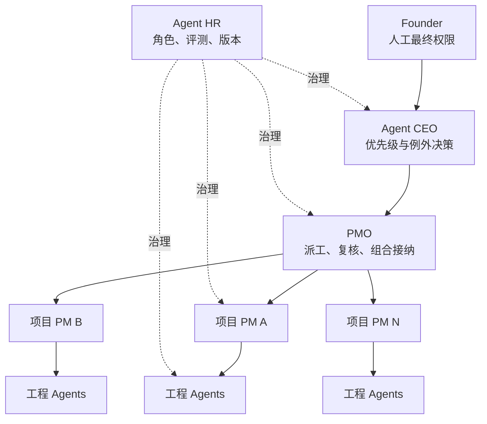

# Agent Project OS

[English](README.md)

**把一个人的 AI 工程组织运行在 Git 上。**

Agent Project OS 是面向个人开发者和一人团队的本地优先工程组织操作系统，用来持续管理多个 AI 原生项目。它把仓库原生 Project Kernel、Founder/CEO/PMO 监督链、Agent 人才治理、确定性周期计划，以及 Codex、Claude Code、DeepSeek Harness Adapter 组合在同一套协议和 CLI 中。

> **Alpha：**当前本地候选版本为 `0.4.0a1`，仅支持从源码安装，尚未打 tag，也未发布到 PyPI。`1.0.0` 之前，公共 Schema 和 CLI 仍可能调整。

它遵循一条简单规则：项目仓库拥有工程事实；组织控制仓库只拥有注册关系、分派、不可变报告、复核记录和证据指针。Agent 负责提案或汇报，确定性代码负责校验，人保留最终决策权。

## 它解决什么问题

当一个人同时维护多个 AI 原生项目时，困难不再只是生成代码，而是持续回答：现在最重要的项目是什么、谁对此负责、哪里被阻塞、下一项验收是什么、哪次监督已经到期，以及某个 Agent 的 Prompt 或 Skill 版本是否仍然可信。

Agent Project OS 为这些问题建立持久、可审查的边界：

- **项目事实跟随项目。** 任务、证据、决策和交接始终保存在各自项目仓库。
- **项目组合有明确责任链。** Founder、Agent CEO、PMO，以及每个活跃项目唯一的 accountable PM 各有职责。
- **Agent 能力变更受到治理。** 角色、评测、候选版本、晋升、回滚、暂停和退役与模型、客户端身份分开记录。
- **监督周期可以确定计算。** 日、周、月到期工作会形成幂等计划，再由外部调度器唤醒。
- **控制面能够删除重建。** JSON、HTML 和 SQLite 视图都只是 Git 记录的可删除投影。
- **Runtime 差异停留在边缘。** Codex、Claude Code 和 DeepSeek Harness 使用各自入口文件，但不会改变核心协议。

## 组织模型



这张金字塔是治理图，而不是 Agent Runtime。Agent Project OS 不启动模型、不控制客户端进程，也不替代 Git。

## 当前包含什么

| 层级 | 当前能力 |
|---|---|
| Project Kernel | Task、E0–E4 Evidence、Decision、Handoff、Inbox Proposal、Acceptance Receipt 和 Activity Event |
| Organization | 组织清单、工程注册表、每个活跃项目唯一 accountable PM、派工、子 PM 报告、PMO 复核、Portfolio Review 和 CEO 例外队列 |
| Agent Workforce | Agent/Role Registry、能力档案、Prompt/Skill 资产摘要、评测、候选版本、晋升、回滚、暂停和退役 |
| Cadence | 带时区的日/周/月到期计算、幂等运行计划、有限重试记录、暂停和关闭 |
| Federation | 跨仓库依赖、接口提供/消费关系、受影响项目计算、版本化交接和接纳回执 |
| Adapters | Codex、Claude Code、DeepSeek Harness 的项目指令、Skill/bundle、生命周期事件归一化和派工渲染 |
| Projections | 可重建 SQLite 索引、只读 JSON/HTML 组织大盘和私有快照对账 |

## 五分钟跑通

### 环境要求

- Python 3.9–3.13
- Git
- macOS 或 Linux；WSL 仍为预览目标

无需凭据或私有数据，直接运行三项目合成组织：

```bash
git clone https://github.com/Jinchengawu/Agent-Project-OS.git
cd Agent-Project-OS
python3 -m venv .venv
. .venv/bin/activate
python -m pip install -e '.[test]'
agent-project --root examples/federated-workspace validate
agent-project --root examples/federated-workspace --json dashboard build --as-of 2026-08-18T12:00:00+08:00 --dry-run
```

最后一条命令只规划可删除大盘，不写入文件，并返回可观察结果：

```json
{
  "agent_count": 5,
  "decision_count": 1,
  "due_count": 1,
  "project_count": 3,
  "status": "planned"
}
```

示例包含三个自治项目、五个 Agent、三个 accountable PM 分派、一次经过复核的 Agent 升级、两份已接纳 PM 报告，以及一份被阻塞并进入 CEO 例外队列的报告。详情见[合成工作区说明](examples/federated-workspace/WORKSPACE.md)。

如果校验失败，CLI 会指出无效记录或跨记录约束，不会静默修复已接纳状态。写命令可先使用 `--dry-run` 检查拟执行变更。

## 仓库模型

每个受管项目保留自己的工程状态：

```text
AGENTS.md
.agent-project/
├── manifest.json
├── policy.json
├── tasks/
├── evidence/
├── decisions/
├── handoffs/
├── inbox/
├── receipts/
└── events/
```

组织控制仓库增加关系和不可变监督记录，但不复制项目任务账本：

```text
.agent-project/
├── organization.json
├── project-registry.json
├── assignments/
├── dispatches/
├── supervision/
├── reports/
├── reviews/
├── workforce/
└── events/
```

当前已接纳状态保存在实体文件中。事件、变更请求、报告和回执使用一条记录一个文件，避免共享 JSONL 追加热点。SQLite 是可选投影，可以删除后重建。

## 核心运行闭环

### CEO/PMO 监督

1. 注册自治项目，并为其分派唯一 accountable PM。
2. 根据监督策略和时区计算到期工作。
3. 生成结构化派工信封，但不直接启动客户端进程。
4. 项目 PM 提交带证据指针的报告，而不是复制一份任务账本。
5. PMO 接纳或拒绝报告；未解决的优先级、Owner、风险和冲突进入 CEO 例外队列。

报告被接纳后才推进下一监督窗口。重放报告、未知项目、重复 PM、不兼容接口和没有证据的完成声明都会被拒绝。

### Agent HR

Agent 身份、Runtime 身份、模型身份和角色分别记录。候选 Agent Release 通过路径、commit 和 SHA-256 指向某个 Prompt、Skill 或 bundle。

晋升必须具有通过的评测，且候选人、Reviewer 和批准人相互分离。校验器会拒绝自我晋升、摘要漂移、多个 active release、缺少回滚点、重复角色，以及仍承担活跃分派时的退役操作。

Agent Project OS 管理生命周期和证据，不拥有 Prompt 或 Skill 内容本身；这些内容可以继续保存在 AI-PMO 一类的独立能力仓库中。

### Cadence 与派工

核心负责计算到期项并生成幂等的 `cadence-run-v1` 计划。Codex Automation、cron、CI 或其他调度器可以唤醒计划，但不能越过人工权限门禁。同一时间窗口重复触发时复用已有运行，不生成重复任务；失败操作具有有限重试记录。

Adapter 把中立派工信封转换为项目内的客户端入口。Worktree、子代理、Agent Teams 或 Plugin composition 仍属于端侧增强，不构成跨客户端表面功能完全相同的承诺。

## 证据门禁工程

任务完成、消费者接纳和外部结果是三种不同事实：

| 等级 | 含义 | 边界 |
|---|---|---|
| E0 | 声明或主张 | 不能证明产物存在 |
| E1 | 已生成产物 | 不能证明确定性验证通过 |
| E2 | 验证命令已执行并通过 | 不能证明消费者接纳 |
| E3 | 有回执支持的消费者接纳 | 不能证明产生外部结果 |
| E4 | 观测到的外部结果 | 只适用于记录中的范围 |

没有已接纳的 E2 或更高等级证据，任务不能进入 `done`。记录 E2 时，CLI 会保存实际执行元数据，而不是信任 Agent 自行声明的 `passed` 字段。

## CLI 命令面

```text
agent-project init
agent-project org init|status|validate
agent-project project add|list|show|assign-pm
agent-project task create|update|submit|accept|reject
agent-project evidence add
agent-project decision propose|accept|reject|supersede
agent-project handoff create|validate
agent-project supervision due|dispatch|submit|accept|reject
agent-project portfolio review
agent-project role add|assign
agent-project agent add|list|show|evaluate|propose-upgrade|promote|rollback|pause|retire
agent-project workforce review
agent-project cadence due|plan|record|close
agent-project adapter render|install|uninstall|doctor|render-dispatch
agent-project migrate portfolio-v1
agent-project dashboard build
agent-project shadow compare
agent-project affected
agent-project index rebuild
agent-project status
agent-project validate
```

写命令支持 `--dry-run`，机器调用方可使用全局 `--json` 参数获取 JSON 输出。

## Runtime 兼容性

| 接入端 | 状态 | 已验证范围与限制 |
|---|---|---|
| Codex | 支持 | `AGENTS.md`、项目 Skill、Adapter golden tests、归一化事件、中立派工渲染，以及历史隔离项目生命周期 smoke |
| Claude Code | 支持 | 通过 `CLAUDE.md` 导入共享规则、项目 Skill、Hooks、Adapter golden tests、派工渲染，以及历史隔离项目生命周期 smoke |
| DeepSeek Harness | 预览 | 固定兼容点上的无凭据 bundle/profile 渲染、事件归一化、golden tests 和 JavaScript 语法检查；不宣称完成带凭据的真实闭环 |

Runtime、`client_version`、可选 `model_id` 和可选 `provider_hint` 分开记录。Claude Code 会话可以使用非 Anthropic 模型，而不会污染客户端身份。

DeepSeek Harness 自身仍处于 Developer Preview，可能出现破坏性变化。此类变化只由 Adapter 吸收，不修改核心 Schema。

详情见[兼容矩阵](docs/COMPATIBILITY.zh-CN.md)、[Adapter 设计](docs/ADAPTERS.zh-CN.md)和[历史客户端 Smoke 记录](release/smoke-results-v0.1.json)。

## 验证状态

`0.4.0a1` 本地门禁在 macOS/Python 3.11 上通过：

- 33 项集成与契约测试；
- 28 份可加载的 Draft 2020-12 Schema，包含正反样例；
- 自托管仓库和合成组织校验；
- 30 项目/50 Agent 合成规模门禁；
- 隐私与双语文档检查；
- Python 编译和 DeepSeek Harness bundle 语法检查；
- 源码包、wheel 构建和隔离 wheel CLI smoke。

这些是本地 Alpha 证据，不代表已有公开采用、达到生产就绪，也不代表私有项目影子门禁已经通过。仓库配置了 Python 3.9–3.13 CI，但本地证据不能替代当前远程 CI 结果。

运行 `python scripts/release_gate.py` 可以执行同一套确定性项目门禁。详情见[Release Candidate 证据](docs/RELEASE-EVIDENCE.zh-CN.md)。

## 安全、隐私与人工权限

核心运行不要求托管服务、云数据库、账户或模型凭据。公共夹具使用合成身份和相对路径。隐私扫描会检查常见凭据、个人绝对路径和私有拓扑名称，但扫描通过不等于已经证明可以安全公开。

需要明确的边界：

- 验证命令使用当前用户权限执行，不提供沙箱；
- 核心只规划工作，不启动或控制 Agent 客户端；
- 生产、凭据、资金、权限升级、公开发布、破坏性迁移和 Agent 晋升保留人工批准；
- 用户级 Adapter 安装必须显式启用，会备份、添加受管标记、保持幂等并支持卸载；
- 只读大盘始终是可删除投影，不会成为第二事实源；
- V1 不提供团队账户、RBAC、云同步、托管 SaaS 或执行隔离。

在敏感仓库中使用前，请阅读[安全策略](SECURITY.zh-CN.md)、[隐私与公共仓库卫生](docs/PRIVACY.zh-CN.md)和[运维说明](docs/OPERATIONS.zh-CN.md)。

## 路线图与发布边界

| 门禁 | 状态 |
|---|---|
| `0.1.0a1` Project Kernel | 已推送的历史基线，按计划不补打 tag |
| `0.2.0a1` CEO/PMO 闭环 | 已实现，并由合成集成测试覆盖 |
| `0.3.0a1` Agent HR | 已实现，并由合成集成测试覆盖 |
| `0.4.0a1` Cadence 与派工 | 当前本地候选 |
| `0.5.0b1` 规模与影子运行 | 公共大盘和合成规模门禁已实现；两轮私有监督周期尚未验证 |
| `1.0.0` 稳定协议 | 规划中；需要冻结 Schema/CLI、验证迁移，并单独批准一个私有项目单真源试点 |

当前不宣称存在 PyPI 包、GitHub Release 或公开版本 tag。详情见[路线图](docs/ROADMAP.zh-CN.md)和[版本策略](docs/VERSIONING.zh-CN.md)。

## 文档

| 文档 | 用途 |
|---|---|
| [方法论](docs/METHOD.zh-CN.md) | 本地优先、仓库原生、联邦自治和证据门禁原则 |
| [架构](docs/ARCHITECTURE.zh-CN.md) | Kernel、Governance、Workforce、Cadence、Adapters 和投影 |
| [组织治理](docs/ORGANIZATION.zh-CN.md) | Founder/CEO/PMO/项目 PM 职责与报告接纳 |
| [Agent Workforce](docs/WORKFORCE.zh-CN.md) | Agent HR 角色、评测、版本、晋升和回滚 |
| [周期监督](docs/CADENCE.zh-CN.md) | 到期计算、幂等、重试和调度器边界 |
| [数据模型](docs/DATA-MODEL.zh-CN.md) | 记录类型、状态和引用关系 |
| [协议](docs/PROTOCOL.zh-CN.md) | 跨项目产物与接纳规则 |
| [运维](docs/OPERATIONS.zh-CN.md) | 重建、迁移、影子对账和恢复 |
| [治理边界](docs/GOVERNANCE-PACKS.zh-CN.md) | 与 AI-PMO、工作流观测工程的集成关系 |

## 参与贡献

项目仍处于 Alpha，欢迎贡献。请从 [CONTRIBUTING.zh-CN.md](CONTRIBUTING.zh-CN.md) 开始，保持核心语义与 Runtime 无关，为行为变化提供确定性证据，并且不要提交私有路径、凭据或真实项目数据。

安全问题请遵循[安全策略](SECURITY.zh-CN.md)，社区参与遵循[行为准则](CODE_OF_CONDUCT.zh-CN.md)。

## 许可证

Agent Project OS 使用 [Apache License 2.0](LICENSE)，归属信息见 [NOTICE](NOTICE)。
