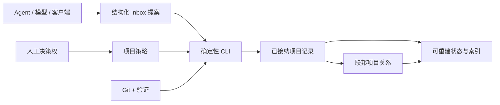

# Agent Project OS

[English](README.md)

**让 AI 工程事实留在仓库里，而不是困在某个客户端的聊天记录里。**

Agent Project OS 是一套本地优先、仓库原生的项目治理协议与 CLI，面向使用 Codex、Claude Code、DeepSeek Harness 长期维护单工程或多个关联工程的个人开发者和一人团队。

> **预发布状态：** `0.1.0a1` 是本地 Release Candidate，目前从源码安装。首个稳定版本发布前，公共 Schema 与 CLI 仍可能调整。

仓库保存事实与规则，Agent 提交结构化变更，确定性 CLI 负责校验和接纳，Portfolio 视图由工程证据重建，人保留对不可逆操作、生产环境、权限、资金和公开发布的决策权。

## 为什么需要它

AI 客户端显示“任务完成”，并不代表仓库验证通过、下游消费者已经接纳，更不代表产生了外部结果。超长对话也很难在不同模型、客户端、机器和仓库之间可靠迁移。

Agent Project OS 把这些事实拆成持久、可审查的边界：

- **项目状态跟随项目。** Git 管理的 JSON 和 Markdown 是可移植事实源。
- **完成必须有证据。** 没有已接纳的 E2 或更高等级证据，任务不能进入 `done`。
- **跨项目交付必须有消费者。** 只有存在已接纳的消费者回执，才能记录 E3。
- **客户端和模型是两种身份。** `runtime`、`client_version`、`model_id`、`provider_hint` 分开记录。
- **控制面可以删除重建。** SQLite 只是查询投影，可从项目与 Portfolio 记录重新生成。
- **客户端差异停留在边缘。** Codex、Claude Code、DeepSeek Harness 的约定由 Adapter 处理，不污染核心协议。

## 运行模型



核心不是 Agent Runtime、模型路由器、在线项目管理器，也不替代 Git；它是这些工具下面共同使用的工程记录层。

## 五分钟跑通

### 环境要求

- Python 3.9–3.13
- 使用 Git 对生成的项目记录进行版本管理
- 当前预发布仓库的源码副本

在仓库根目录创建虚拟环境并安装 CLI：

```bash
python3 -m venv .venv
. .venv/bin/activate
python -m pip install -e .
agent-project --help
```

在源码仓库旁创建一个干净项目：

```bash
mkdir -p ../agent-project-demo
cd ../agent-project-demo
agent-project init --project-id demo --name "Demo Project"
agent-project validate
agent-project adapter render --adapter all
agent-project status --json
```

你会看到 `AGENTS.md` 和 `.agent-project/`：其中包含 manifest、policy，以及独立的任务、证据、决策、交接、Inbox 提案、回执和事件目录。Adapter 命令会生成三个客户端对应的项目级集成文件。

如果初始化拒绝写入，请换到空目录，或先用 `agent-project init ... --dry-run` 查看拟写入内容。如果校验失败，CLI 会指出无效记录或跨记录约束，并且不会静默修复已接纳状态。

### 查看联邦工作区

回到源码仓库根目录，校验完全合成的三项目工作区，并计算 `contracts` 变更会影响哪些下游项目：

```bash
agent-project --root examples/federated-workspace validate
agent-project --root examples/federated-workspace --json affected --project-id contracts
agent-project --root examples/federated-workspace --json index rebuild
```

影响分析结果包含 `client` 和 `service`；重建索引会报告三个项目、三个任务、三条证据和一份接纳回执。详情见[工作区说明](examples/federated-workspace/WORKSPACE.md)。

## v0.1 包含什么

### 仓库原生项目记录

```text
AGENTS.md
.agent-project/
├── manifest.json
├── policy.json
├── tasks/
├── evidence/
├── decisions/
├── handoffs/
├── inbox/
├── receipts/
└── events/
```

当前已接纳状态保存在实体文件中。事件、变更请求和回执一条记录一个文件，避免所有 Agent 共同追加同一个 JSONL 文件。SQLite 是可选、可删除的查询投影。

### 证据门禁生命周期

任务状态流转：

```text
planned → ready → in_progress → blocked / waiting_review → done
                         ↘ paused / cancelled
```

证据等级严格分离：

| 等级 | 含义 | 不能证明什么 |
|---|---|---|
| E0 | 声明或主张 | 产物已经存在 |
| E1 | 已生成的产物 | 确定性验证已经通过 |
| E2 | 验证命令确实执行并通过 | 消费者已经接纳 |
| E3 | 有接纳回执支持的消费者接纳 | 已经产生外部结果 |
| E4 | 观测到的外部结果 | 超出记录范围的其他结果 |

记录 E2 时，CLI 会执行指定的验证命令，并保存退出码、执行时间、耗时和有边界的输出摘要。Agent 不能仅提交一个自称 `passed` 的字符串就把证据提升为 E2。

### 联邦式 Portfolio

`portfolio.json` 登记自治仓库，但不复制各项目的领域状态。目录包含 owner、生命周期、仓库位置、验证命令、`depends_on`、`provides`、`consumes`。

校验器会拒绝未知项目、依赖环、精确接口版本不兼容、未知生产者、无效成员项目以及未接纳的跨项目回执。`agent-project affected` 用于计算传递性的下游影响。

### 确定性 CLI

当前命令面包括：

```text
agent-project init
agent-project validate
agent-project project add|list|show
agent-project task create|update|submit|accept|reject
agent-project evidence add
agent-project decision propose|accept|reject|supersede
agent-project handoff create|validate
agent-project affected
agent-project adapter render|install|uninstall|doctor
agent-project index rebuild
agent-project status
```

所有写命令提供 `--dry-run`；机器调用方可以使用全局 `--json` 参数获取 JSON 输出。

## Runtime 兼容性

以下状态和实测结果仅对应 2026-08-14 的 Release Candidate 证据。

| 接入端 | v0.1 状态 | 已验证范围与限制 |
|---|---|---|
| Codex | 支持 | 项目 `AGENTS.md` 与 Skill Adapter；隔离任务闭环在客户端 `0.147.0-alpha.6.5`、模型 `gpt-5.6-sol` 下通过 |
| Claude Code | 支持 | `CLAUDE.md` 导入共享规则，提供 Skill 与生命周期 Hook Adapter；隔离任务闭环在客户端 `2.1.181`、模型 `deepseek-v4-pro` 下通过 |
| DeepSeek Harness | 预览 | 无凭据 bundle、profile patch、事件归一化、Schema、golden-file 与 JavaScript 语法检查通过；固定兼容 `0.1.0-rc.5` / `47f9438`；不宣称完成了带真实凭据的运行闭环 |

Claude Code 实测直接展示了这套身份规则：客户端和实际模型相互独立。Worktree、子代理、Agent Teams、Plugin composition 属于客户端增强能力，不作为跨客户端功能一致性的承诺。

| 环境 | 状态 | 证据边界 |
|---|---|---|
| Python 3.9–3.13 | 声明支持 | Runtime 只使用标准库；仓库已配置对应 CI 矩阵，当前本地门禁实际运行于 Python 3.11 |
| macOS | 支持 | 当前本地 Release Gate 在 macOS 完成 |
| Linux | 支持目标 | 已配置 CI 矩阵，但当前尚无远程 CI 结果 |
| WSL | 预览 | 预期遵循 Linux 行为，不属于 v0.1 发布阻断矩阵 |

完整信息见[兼容矩阵](docs/COMPATIBILITY.zh-CN.md)、[Release Candidate 证据](docs/RELEASE-EVIDENCE.zh-CN.md)和[机器可读 Smoke 摘要](release/smoke-results-v0.1.json)。

## Adapter 行为

- **Codex：**生成 `AGENTS.md` 集成以及 `.agents/skills/agent-project-os/`。
- **Claude Code：**生成受管的 `CLAUDE.md` 导入、`.claude/skills/`、生命周期 Hook 和归一化事件桥。
- **DeepSeek Harness：**生成固定版本的预览 Cordis bundle 与 profile patch，不改变核心 Schema 语义。

Adapter 默认只处理项目内文件。修改用户级配置必须显式传入 `--user`；安装会备份原内容、使用受管标记、保持幂等并支持卸载。发现已被用户修改的生成文件时，CLI 会报告冲突而不是静默覆盖。详情见 [Adapter 设计](docs/ADAPTERS.zh-CN.md)。

## 安全、隐私与人工权限

核心运行不要求云服务、托管数据库、账户或真实模型凭据。公开夹具只使用合成身份和相对路径。仓库隐私门禁会扫描常见凭据、个人绝对路径和私有拓扑名称，但扫描通过不等于已经证明可以安全公开。

需要明确的边界：

- 验证命令以当前用户的本地权限执行，不提供沙箱；
- 用户级 Adapter 安装必须主动选择；
- Agent 生成的提案不会因为“已经生成”就自动成为接纳状态；
- 生产访问、凭据、不可逆操作、资金、远程发布、tag 和 release 均保留人工授权；
- Agent Project OS 不提供 RBAC、云同步或执行隔离。

处理敏感工程前，请阅读[隐私与公共仓库卫生](docs/PRIVACY.zh-CN.md)和[安全策略](SECURITY.zh-CN.md)。

## 验证

本地 Release Gate 运行 23 项测试，覆盖核心生命周期、过期提案、伪造 E2/E3 拒绝、决策、交接、联邦失败场景、确定性索引重建、JSON Schema 正反样例、Adapter golden file、配置保留、幂等、卸载、事件归一化、合成工作区、隐私、双语文档以及 DeepSeek Harness bundle 语法。

安装测试依赖后运行：

```bash
python -m pip install -e '.[test]'
python scripts/release_gate.py
```

这些是本地验证证据，不代表已有用户采用、达到生产就绪状态，或已由外部 CI 执行。

## 当前限制

- `0.1.0a1` 目前只能从源码安装；不宣称已经存在 PyPI 包、GitHub Release 或公开 tag。
- DeepSeek Harness 仍是预览适配，上游接口变化时可能需要更新 Adapter。
- Linux 是已配置的支持目标，但当前仓库状态尚无远程 CI 执行记录。
- 核心不提供 Web 看板、团队账户、RBAC、云同步或 MCP Server。
- Portfolio 接口兼容策略有意保持严格，当前使用精确版本匹配。
- 真实私有项目尚未迁移到公开夹具中。

未来工作单独记录在[路线图](docs/ROADMAP.zh-CN.md)，不会混入当前能力列表。

## 文档索引

| 文档 | 用途 |
|---|---|
| [方法论](docs/METHOD.zh-CN.md) | 运行原则与状态边界 |
| [架构](docs/ARCHITECTURE.zh-CN.md) | Core、Federation、Projection、Adapter 和治理包 |
| [数据模型](docs/DATA-MODEL.zh-CN.md) | 记录类型与生命周期状态 |
| [协议](docs/PROTOCOL.zh-CN.md) | 跨项目产物与接纳规则 |
| [Adapter 设计](docs/ADAPTERS.zh-CN.md) | 项目级/用户级安装和客户端行为 |
| [兼容矩阵](docs/COMPATIBILITY.zh-CN.md) | 支持、预览与证据边界 |
| [治理包](docs/GOVERNANCE-PACKS.zh-CN.md) | 可选 PMO 与工作流观测集成边界 |
| [版本策略](docs/VERSIONING.zh-CN.md) | Schema、CLI 与 Adapter 的兼容规则 |

## 参与贡献

项目仍处于预发布阶段，欢迎参与完善。请从 [CONTRIBUTING.zh-CN.md](CONTRIBUTING.zh-CN.md) 开始，保持核心 Runtime-neutral，为行为变化补充确定性证据，并且不要提交私有路径、凭据或真实项目数据。

安全问题请按[安全策略](SECURITY.zh-CN.md)提交；社区参与遵循[行为准则](CODE_OF_CONDUCT.zh-CN.md)。

## 许可证

Agent Project OS 使用 [Apache License 2.0](LICENSE)，归属信息见 [NOTICE](NOTICE)。
