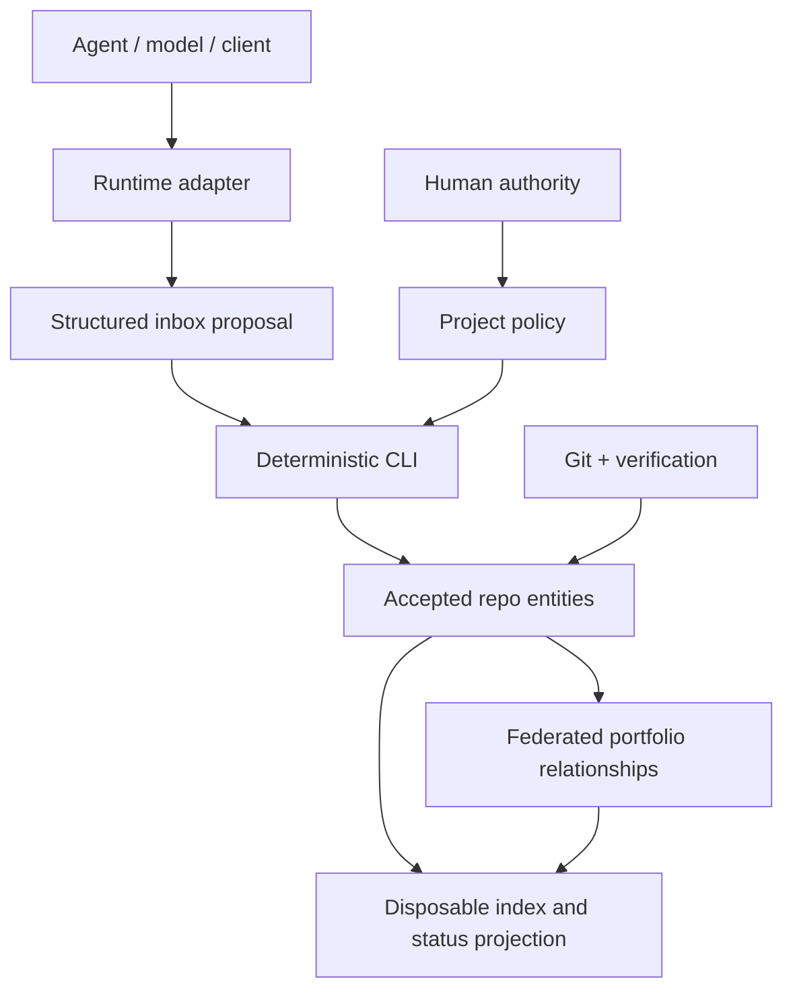

# Architecture

[中文](ARCHITECTURE.zh-CN.md)

## Boundary

Agent Project OS is a protocol and deterministic local CLI, not an agent runtime or Web product. Core records describe project governance without naming a model provider or client. Adapters translate client lifecycle and instruction conventions into the shared protocol.

## Layers

### 1. Core

Owns project manifests, policies, tasks, evidence, decisions, handoffs, change requests, acceptance receipts, activity events, runtime-adapter events, lifecycle invariants, and validation.

### 2. Federation

`portfolio.json` records projects and dependency/interface edges. It calculates transitive impact and validates cycles, unknown projects, incompatible interface versions, and unaccepted cross-project receipts. It does not copy task or domain state.

### 3. Projection

`.agent-project/index.sqlite3` is a disposable local query cache. `agent-project index rebuild` recreates it exclusively from repository records. No accepted write is made only to SQLite.

### 4. Runtime adapters

- Codex: `AGENTS.md` and project Skill.
- Claude Code: `CLAUDE.md` imports `AGENTS.md`; project Skill and lifecycle hooks emit normalized events.
- DeepSeek Harness: a pinned preview Cordis bundle listens to session/tool/agent events.

Adapter failure cannot change core record semantics. User-level writes require `--user`, preserve prior content, use managed state, and support uninstall.

### 5. Optional governance packs

AI-PMO-style portfolio governance and workflow-observation bridges integrate through versioned Schema/CLI interfaces. They remain separate packages and cannot own accepted project task state.

## Write paths

- Direct accepted write: a human or policy-authorized CLI action updates an entity and records an event.
- Proposed write: an Agent submits a change request to `inbox/`; acceptance applies it only if the base record is still current.
- Cross-project delivery: the producer identifies an immutable artifact; the consumer writes an acceptance receipt; E3 evidence cites that receipt.

One record per audit/event/receipt file avoids a shared JSONL append hotspot and reduces concurrent Git merge conflicts.

## Failure posture

Validation fails closed on incompatible protocol versions, illegal transitions, missing required evidence, stale change requests, unknown references, graph cycles, interface mismatches, and modified managed adapter files. The CLI does not silently repair accepted state.
