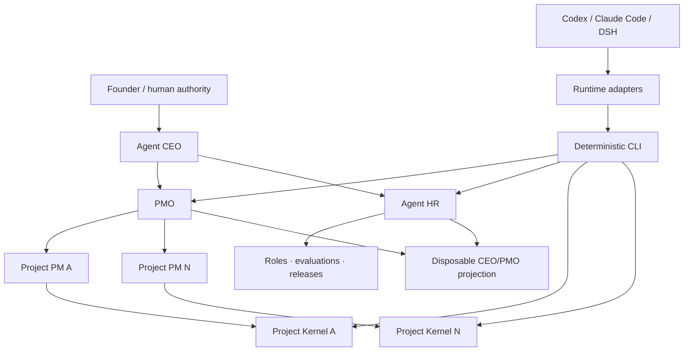

# Architecture

[中文](ARCHITECTURE.zh-CN.md)

## Boundary

Agent Project OS is a local organization protocol and deterministic CLI, not an agent runtime or hosted project manager. Its Project Kernel preserves engineering facts; built-in Governance, Workforce, and Cadence modules coordinate the local Harness without naming a model provider or client. Adapters translate client conventions into the shared protocol.

## Layers

### 1. Core

Owns project manifests, policies, tasks, evidence, decisions, handoffs, change requests, acceptance receipts, activity events, runtime-adapter events, lifecycle invariants, and validation.

### 2. Governance

`organization.json` and `project-registry.json` record the Founder/CEO/PMO structure, project priorities, PM assignments, dependency/interface edges, and supervision policy. Dispatch, immutable child-PM reports, PMO reviews, portfolio reviews, and CEO exceptions form the vertical control loop. Project tasks remain in project repositories.

### 3. Workforce

Agent HR owns neutral Agent and Role registries, capability profiles, asset releases, evaluations, upgrade proposals, promotion, rollback, pause, and retirement. Concrete Prompt/Skill content remains in its owning capability repository and is referenced by path, commit, and SHA-256.

### 4. Cadence

Cadence computes due work, idempotent run windows, and bounded attempts. External schedulers wake plans; the core does not run a daemon or control client processes. Client dispatch rendering is output-only.

### 5. Projection

`.agent-project/index.sqlite3` plus the local HTML/JSON dashboard are disposable query projections. Rebuild commands recreate them exclusively from repository records. No accepted write is made only to SQLite or the dashboard.

### 6. Runtime adapters

- Codex: `AGENTS.md` and project Skill.
- Claude Code: `CLAUDE.md` imports `AGENTS.md`; project Skill and lifecycle hooks emit normalized events.
- DeepSeek Harness: a pinned preview Cordis bundle listens to session/tool/agent events.

Adapter failure cannot change core record semantics. User-level writes require `--user`, preserve prior content, use managed state, and support uninstall.

### 7. Capability packs and bridges

Organization governance and Agent HR are built into the neutral core package. AI-PMO-style repositories may own concrete roles, Skills, Prompts, and evaluation sets; workflow-observation bridges may propose improvements. They integrate through versioned Schema/CLI interfaces and cannot own accepted project task state.

## Write paths

- Direct accepted write: a human or policy-authorized CLI action updates an entity and records an event.
- Proposed write: an Agent submits a change request to `inbox/`; acceptance applies it only if the base record is still current.
- Cross-project delivery: the producer identifies an immutable artifact; the consumer writes an acceptance receipt; E3 evidence cites that receipt.

One record per audit/event/receipt file avoids a shared JSONL append hotspot and reduces concurrent Git merge conflicts.

## Failure posture

Validation fails closed on incompatible protocol versions, illegal transitions, missing required evidence, duplicate PMs, stale project commits, self-review or self-promotion, asset digest drift, unknown references, graph cycles, interface mismatches, duplicate cadence windows, and invalid rollback points. The CLI does not silently repair accepted state.
