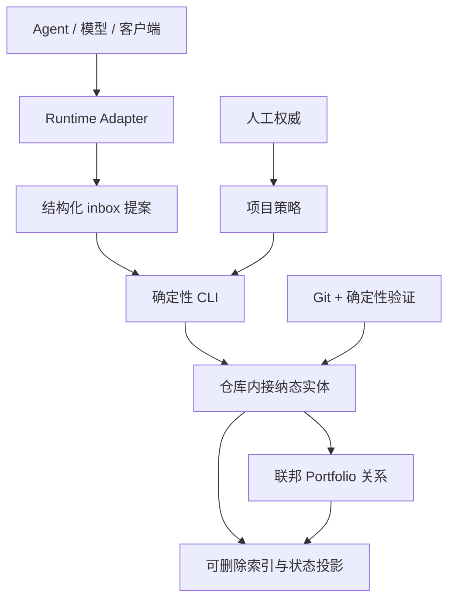

# 架构

[English](ARCHITECTURE.md)

## 系统边界

Agent Project OS 是协议与确定性本地 CLI，不是 Agent runtime，也不是 Web 产品。核心记录描述项目治理，但不绑定模型供应商或客户端；Adapter 把各客户端的生命周期与指令约定翻译为统一协议。

## 分层

### 1. Core

负责项目 manifest、policy、任务、证据、决策、交接、变更请求、接纳回执、活动事件、runtime adapter 事件、生命周期不变量和校验。

### 2. Federation

`portfolio.json` 只记录项目与依赖/接口边。它计算传递影响范围，并拒绝循环、未知项目、接口版本不兼容和未接纳跨项目回执；它不复制任务或领域状态。

### 3. Projection

`.agent-project/index.sqlite3` 是可删除的本地查询缓存。`agent-project index rebuild` 只能从仓库记录重建；任何接纳态写入都不能只存在 SQLite 中。

### 4. Runtime Adapters

- Codex：`AGENTS.md` 与项目 Skill。
- Claude Code：`CLAUDE.md` 导入 `AGENTS.md`；项目 Skill 和生命周期 Hooks 输出归一化事件。
- DeepSeek Harness：固定兼容点的预览 Cordis bundle 监听 session/tool/agent 事件。

Adapter 失败不得改变核心记录语义。用户级写入必须显式使用 `--user`，保留原内容，记录受管状态，并支持卸载恢复。

### 5. 可选治理包

AI-PMO 风格的 Portfolio 治理与工作流观测桥通过版本化 Schema/CLI 接口集成。它们保持独立包，不得拥有项目的接纳态任务状态。

## 写入路径

- 直接接纳写入：人工或策略授权的 CLI 动作更新实体并记录事件。
- 提案写入：Agent 把变更请求提交到 `inbox/`；只有基线记录仍然有效时，接纳动作才应用变更。
- 跨项目交付：生产者标识不可变产物，消费者写入接纳回执，E3 证据引用该回执。

审计事件和回执采用“一条记录一个文件”，避免共享 JSONL 追加热点并降低 Git 并发合并冲突。

## 失败策略

遇到不兼容协议版本、非法状态迁移、证据缺失、过期变更请求、未知引用、依赖循环、接口不兼容或受管 Adapter 文件被改动时，校验失败并关闭写入。CLI 不会静默修复接纳态。
