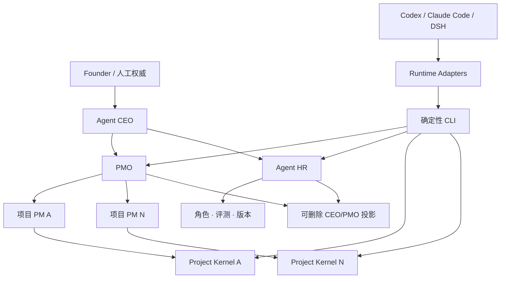

# 架构

[English](ARCHITECTURE.md)

## 系统边界

Agent Project OS 是本地组织协议与确定性 CLI，不是 Agent runtime 或托管项目管理器。Project Kernel 保存工程事实；内置 Governance、Workforce 和 Cadence 模块协调本地 Harness，但不绑定模型供应商或客户端。Adapter 只把客户端惯例转换为统一协议。

## 分层

### 1. Core

负责项目 manifest、policy、任务、证据、决策、交接、变更请求、接纳回执、活动事件、runtime adapter 事件、生命周期不变量和校验。

### 2. Governance

`organization.json` 与 `project-registry.json` 登记 Founder/CEO/PMO 结构、项目优先级、PM 分派、依赖/接口边和监督策略。dispatch、不可变子 PM 报告、PMO 评审、Portfolio Review 与 CEO 例外构成纵向控制闭环；项目任务仍归各项目仓库。

### 3. Workforce

Agent HR 拥有中立的 Agent/Role 注册表、能力档案、资产版本、评测、升级提案、晋升、回滚、暂停和退役。具体 Prompt/Skill 内容仍归能力仓库，通过路径、commit 和 SHA-256 引用。

### 4. Cadence

Cadence 只计算到期项、幂等运行窗口和有限尝试。外部调度器负责唤醒；核心不运行 daemon，也不控制客户端进程。客户端派工渲染只有输出。

### 5. Projection

`.agent-project/index.sqlite3` 与本地 HTML/JSON 大盘都是可删除查询投影。重建命令只从仓库记录生成它们，不允许任何接纳写只存在于 SQLite 或大盘。

### 6. Runtime Adapters

- Codex：`AGENTS.md` 与项目 Skill。
- Claude Code：`CLAUDE.md` 导入 `AGENTS.md`；项目 Skill 和生命周期 Hooks 输出归一化事件。
- DeepSeek Harness：固定兼容点的预览 Cordis bundle 监听 session/tool/agent 事件。

Adapter 失败不得改变核心记录语义。用户级写入必须显式使用 `--user`，保留原内容，记录受管状态，并支持卸载恢复。

### 7. 能力包与桥接

组织治理与 Agent HR 已内置在中立核心包中。AI-PMO 类仓库可以拥有具体角色、Skills、Prompts 与评测集；工作流观测桥可以提出改进。它们通过版本化 Schema/CLI 接口集成，不能拥有项目接纳态任务状态。

## 写入路径

- 直接接纳写入：人工或策略授权的 CLI 动作更新实体并记录事件。
- 提案写入：Agent 把变更请求提交到 `inbox/`；只有基线记录仍然有效时，接纳动作才应用变更。
- 跨项目交付：生产者标识不可变产物，消费者写入接纳回执，E3 证据引用该回执。

审计事件和回执采用“一条记录一个文件”，避免共享 JSONL 追加热点并降低 Git 并发合并冲突。

## 失败策略

遇到不兼容协议版本、非法状态迁移、证据缺失、重复 PM、过期项目 commit、自审或自我晋升、资产 digest 漂移、未知引用、依赖循环、接口不兼容、重复 Cadence 窗口或失效回滚点时，校验失败关闭。CLI 不会静默修复接纳态。
