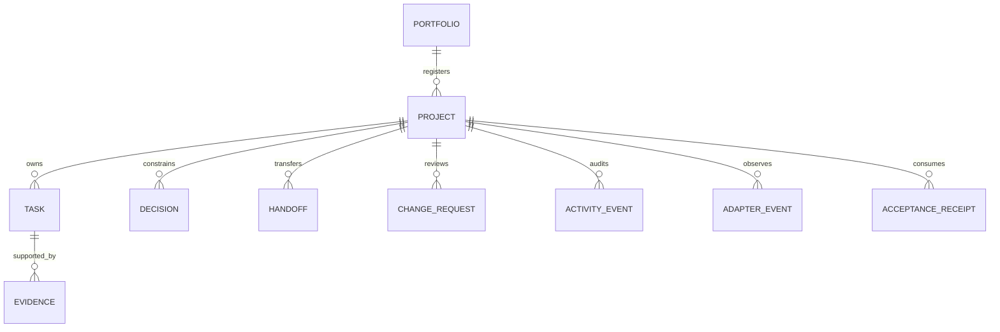
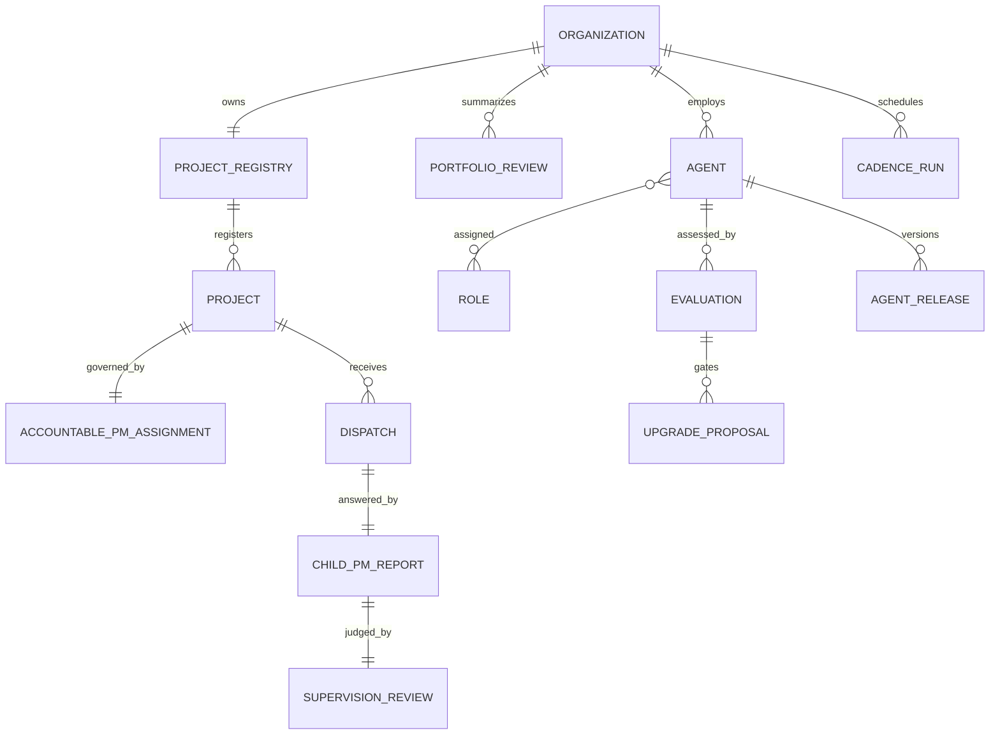

# Data Model

[中文](DATA-MODEL.zh-CN.md)

The normative field contracts are JSON Schema Draft 2020-12 documents under `schemas/`. This document explains relationships and semantics.



## Entities

- **Project manifest:** stable project identity, owner, lifecycle, repository metadata, and deterministic verification commands.
- **Portfolio manifest:** project catalog plus `depends_on`, `provides`, and `consumes`. Paths are portable relative paths in public examples.
- **Task:** an outcome-oriented unit with explicit acceptance criteria, owner, status, blocker, and evidence references.
- **Evidence:** a typed statement at E0–E4. Grade and acceptance status are independent.
- **Decision:** proposed, accepted/rejected, then optionally superseded by another known accepted decision.
- **Handoff:** bounded continuation context between actors/runtimes/projects; it is not a transcript dump.
- **Change request:** an inbox proposal with operation, entity, base version, patch, runtime identity, and review outcome.
- **Acceptance receipt:** consumer judgment over a producer artifact identified by protocol/version, commit, and SHA-256.
- **Activity event:** immutable audit record for accepted state transitions.
- **Runtime adapter event:** normalized client lifecycle observation with separate runtime/client/model/provider identity.

## Task lifecycle

```text
planned -> ready -> in_progress -> waiting_review -> done
                         |              |
                         v              v
                      blocked <---------+
```

`paused` and `cancelled` are side states. `blocked -> in_progress` resumes work; `done -> in_progress` is an explicit reopen. A transition to `done` requires accepted E2-or-stronger evidence.

## Evidence grades

| Grade | Meaning | Does not prove |
|---|---|---|
| E0 | A claim or declaration | Artifact existence or correctness |
| E1 | A produced artifact | Deterministic correctness |
| E2 | A reproducible deterministic validation passed | Consumer acceptance or external impact |
| E3 | An identified consumer accepted an identified artifact | Business/external outcome |
| E4 | A measured external outcome | Permanent causality beyond the evidence |

## Blocker types

`dependency`, `needs_input`, `capability`, `transient`, and `risk_gate` are stable machine-readable categories. Human-readable summaries explain the concrete condition.

## Storage rules

Accepted entity files are mutable current state. Audit events, change requests, and receipts use one JSON object per file. SQLite and rendered dashboards are derived caches. Unknown major protocol versions are rejected rather than guessed.

## Organization model



Organization records store governance relationships and immutable review artifacts. They do not own project task state. Agent releases identify external Prompt, Skill, or bundle assets by path, commit, and SHA-256. Dashboard JSON/HTML and SQLite tables are not entities; they are disposable projections.

See [Organization](ORGANIZATION.md), [Workforce](WORKFORCE.md), and [Cadence](CADENCE.md) for transition rules.
