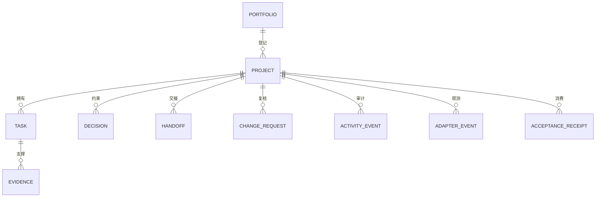

# 数据模型

[English](DATA-MODEL.md)

规范字段契约位于 `schemas/` 下，采用 JSON Schema Draft 2020-12。本文解释关系与语义。



## 实体

- **Project manifest：** 稳定项目身份、owner、生命周期、仓库元数据和确定性验证命令。
- **Portfolio manifest：** 项目目录，以及 `depends_on`、`provides`、`consumes`。公开样例只使用可移植相对路径。
- **Task：** 面向结果的工作单元，包含明确验收标准、owner、状态、阻塞和证据引用。
- **Evidence：** E0–E4 类型化陈述；证据等级与接纳状态彼此独立。
- **Decision：** 先提议，再接纳/拒绝；已接纳决策可被另一个已知且已接纳的决策替代。
- **Handoff：** 在 actor/runtime/project 之间传递边界清晰的继续执行上下文，不保存完整对话转储。
- **Change request：** inbox 提案，包含动作、实体、基线版本、patch、runtime 身份和复核结果。
- **Acceptance receipt：** 消费者对生产者产物的判断；产物由协议/版本、commit 和 SHA-256 标识。
- **Activity event：** 接纳态迁移的不可变审计记录。
- **Runtime adapter event：** 归一化客户端生命周期观测，并分开记录 runtime/client/model/provider 身份。

## 任务生命周期

```text
planned -> ready -> in_progress -> waiting_review -> done
                         |              |
                         v              v
                      blocked <---------+
```

`paused` 与 `cancelled` 是侧向状态；`blocked -> in_progress` 表示恢复，`done -> in_progress` 表示显式重开。进入 `done` 必须具备已接纳的 E2 或更高级证据。

## 证据等级

| 等级 | 含义 | 不能证明 |
|---|---|---|
| E0 | 声明或主张 | 产物存在或正确 |
| E1 | 已产生的产物 | 确定性正确 |
| E2 | 可复现的确定性校验通过 | 消费者接纳或外部影响 |
| E3 | 已识别消费者接纳了已识别产物 | 业务/外部结果 |
| E4 | 已测量的外部结果 | 超出证据范围的永久因果关系 |

## 阻塞类型

`dependency`、`needs_input`、`capability`、`transient`、`risk_gate` 是稳定机器可读分类；人类可读摘要说明具体条件。

## 存储规则

接纳态实体文件保存可变的当前状态。审计事件、变更请求和回执采用“一条 JSON 对象一个文件”。SQLite 与渲染看板只是派生缓存。未知主协议版本必须拒绝，不能猜测兼容。
